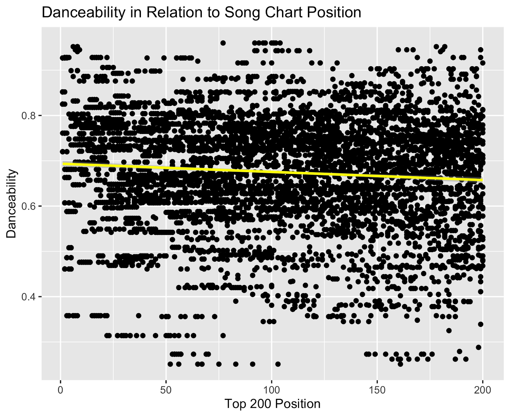
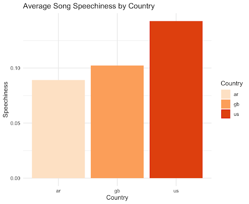

# Global Music Features at a Glance

Spotify has been a staple in the growing music streaming industry since its launch in 2008. The platform has since added a variety of utilities to provide users with a seamless listening experience, and amassed over 248 million users as of 2019.

Similarly to well known music rankings such as Billboard Music’s Top 100, Spotify offers users the ability to query music based on being in the Spotify Top 50 playlist. Naturally, the pop music that dominates the top spots will vary by country especially across language barriers. Investigating the components of the top songs of different countries provides an interesting opportunity to highlight a potential commonality across human music taste that underlies what songs will be commercially successful. Considering this massive global presence, the current project sought to quantitatively assess the differences in musical features of songs on the top 50 charts. A secondary question of this project analyzed the differing qualities of top songs within and across languages. To carry this out, I used a publicly available dataset tracking the top 200 songs each day in a variety of countries from Kaggle
(https://www.kaggle.com/edumucelli/spotifys-worldwide-daily-song-ranking).

# Preparing the Data
Quantitative measures for various audio features were collected by scraping the data using Spotify’s API, with access through the Python package ‘Spotipy’. This project took a combined approach of using R for data preprocessing, Python for scraping and compiling audio feature data for each song in the daily top 200, and returning to R to complete analysis and visualization.

I decided to limit the data to the Top 200 each day of first week of 2017, totaling 6000 songs, mostly because my poor computer was already screaming at me with this much. 

After adding columns of *NA*s in R for each audio feature to be examined, here's what the preliminary Kaggle data looked like:

Position | Track Name | Artist | Streams | URL | Date | Region | Danceability | Duration | Instrumentalness | Speechiness | Tempo
------------ | ------------- | ------------- | ------------- | ------------- | ------------- | ------------- | ------------- | ------------- | ------------- | ------------- | -------------
1 | Bad and Boujee (feat. Lil Uzi Vert) | Migos | 1371493 | Content from cell 2 | Content from cell 2 | Content from cell 2 | Content from cell 2 | Content from cell 2 | Content from cell 2 | Content from cell 2 | Content from cell 2
2 | Content in the second column | Content in the second column | Content in the second column | Content in the second column | Content in the second column | Content in the second column | Content in the second column | Content in the second column | Content in the second column | Content in the second column | Content in the second column

Since I need what's known as the "track ID" (the last section of numbers and letters in the URL after the /) to feed into our Python script to find audio features, I used a regex to find the important characters that started with a number.
```
#Regular expression to remove the extraneous characters in the track ID, which is located at the end of the URL
musica$URL <- regmatches(musica$URL, regexpr("[0-9].*", musica$URL, perl = TRUE))
```

Next up, I need to fill those *NA*s with audio feature data using the Spotipy library in Python. The Spotipy library provides some interesting features such as danceability, tempo, speechiness, and more. For more in-depth information, [visit the Spotify developer page](https://developer.spotify.com/documentation/web-api/reference/tracks/get-audio-features/). 

In Python, I need to create a dataframe with only the audio features important for my analysis. This function will do all of the heavy lifting in the subsequent for loop, compiling the audio features for all of the songs in my data.
```
def find_data(song):                                                                                          
    # Returns results as a list of dictionaries                                                               
    results = sp.audio_features(tracks=[song])                                                                
    audio_features = pd.DataFrame(results)                                                                    
    audio_features = audio_features[                                                                          
        ['danceability', 'duration_ms', 'energy', 'id',                                                       
         'instrumentalness', 'key', 'liveness', 'loudness', 'mode', 'speechiness', 'tempo', 'time_signature', 
         'type', 'valence']]                                                                                  
    music_data['Danceability'][index] = audio_features['danceability']                                        
    music_data['Duration'][index] = audio_features['duration_ms']                                             
    music_data['Instrumentalness'][index] = audio_features['instrumentalness']                                
    music_data['Speechiness'][index] = audio_features['speechiness']                                          
    music_data['Tempo'][index] = audio_features['tempo']                                                      
```
Now, to run it using a simple for loop.

```
index = 0        
for i in music_da
    song = i     
    find_data(son
    index += 1   
```

And just like that, I've got a dataframe full of audio feature data!

Position | Track Name | Artist | Streams | URL | Date | Region | Danceability | Duration | Instrumentalness | Speechiness | Tempo
------------ | ------------- | ------------- | ------------- | ------------- | ------------- | ------------- | ------------- | ------------- | ------------- | ------------- | -------------
1 | Bad and Boujee (feat. Lil Uzi Vert) | Migos | 1371493 | Content from cell 2 | Content from cell 2 | Content from cell 2 | Content from cell 2 | Content from cell 2 | Content from cell 2 | Content from cell 2 | Content from cell 2
2 | Content in the second column | Content in the second column | Content in the second column | Content in the second column | Content in the second column | Content in the second column | Content in the second column | Content in the second column | Content in the second column | Content in the second column | Content in the second column

Now for the fun stuff...analysis!

# Linear Regression
From my linear regression analyses analyzing the degree to which a song’s chart position changes as a function of the song’s danceability, I discovered a significant negative association (F(1,5998) = 41.1, p < .001), and R<sup>2</sup> = .006. This means as danceability went down, chart position went **up**, which is not ideal when a top spot on the charts is actually a low number. Unsurprisingly, the people want to dance!



With an R<sup>2</sup> of only .006, only .6% of the variation in chart position is explained by danceability. This does not provide strong evidence
to support their consistent, reliable importance to defining a chart topping song.

My second linear regression is based on the presumption that since hip-hop, a music form reliant on rhyming and heavy lyricism, is so prevalent in the United States top charts now, speechiness may be related to chart position. This proved true, showing a similar negative association to that of danceability, F(1,5998) = 70.14, p < .001.), and R<sup>2</sup> = .01. Now, since hip-hop's originated in the Bronx of New York, other countries may not resonate with it quite as much yet which may show itself in decreased speechiness for other countries. I felt this would be an interesting feature to look at by country.

# Speechiness by Country

When I broke down speechiness by the three countries I sampled (Argentina, Great Britain, and the United States) the difference was fasincating! It was clear the United States had much "speechier" music in the top charts, likely because of hip-hop's global presence. This cultural difference in speechiness was confirmed by auxiliary analyses (t-tests) testing the difference in mean speechiness between the United States and Great Britain (p < .001), as well as between that of English-speaking countries and a non-English speaking country (p < .001).



We do see that Great Britain has a slight edge on Argentina in terms of speechiness, and this may be in part due to the rise of hip-hop there as well (especially in the form of grime hip-hop, with fruntrunners such as Stormzy and Skepta). 

Finally, a quick dot plot grid chart allows us to get a crude look at the distribution of those speechy songs. It's clear that in the United States, songs high in speechiness were far more able to break top chart positions than in Great Britain, and definitely than in Argentina. 
